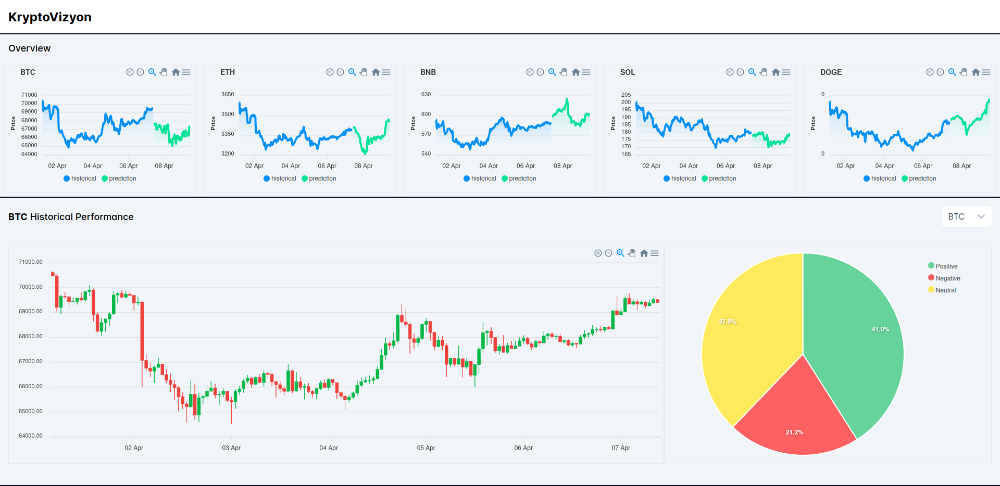
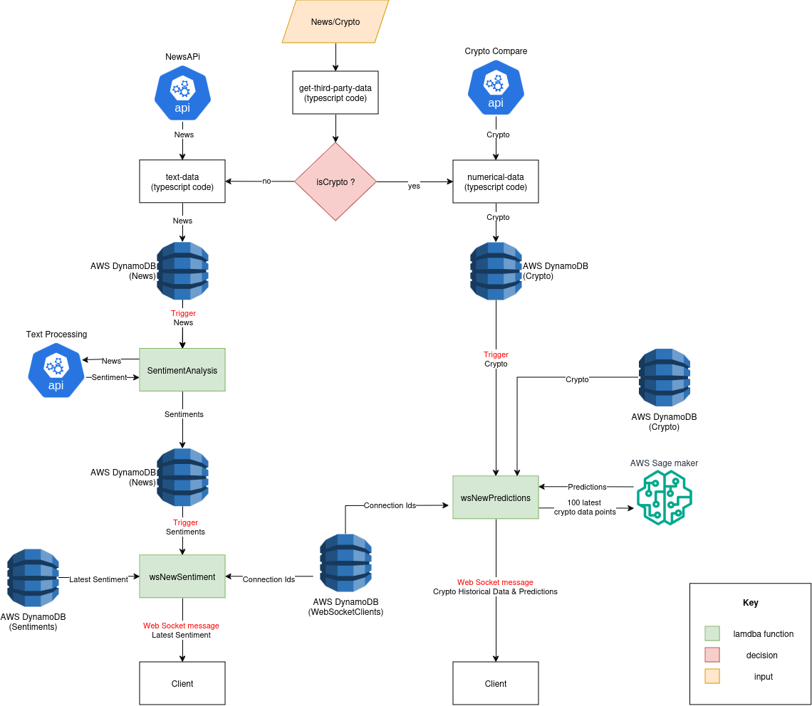

# KryptoVizyon

This project is a cryptocurrency cloud-based data visualization
website, which displays the numerical data, market predictions and sentiment analysis of five
cryptocurrencies (BTC, ETH, BNB, SOL, and DOGE), using the latest third-party web services.

## Technologies Used

- Vue.js 3
- Typescript
- Tailwind CSS
- AWS Services (Lambda, API Gateway, DynamoDB, S3, SageMaker, CloudWatch)

## API Used

- [TextProcessing API](https://www.cryptocompare.com/)
- [CryptoCompare API](https://www.cryptocompare.com/)
- [NewsAPI](https://newsapi.org/)

## Serverless Architecture

## Dynamo DB Schema

Create tables with the following configurations:

| Table Name        | Partition Key | Sort Key               | Read Capacity          | Write Capacity | GSI Name                  | GSI Partition Key | GSI Sort Key          |
| -----------       | -----------   | -----------            | -----------            | -----------    | -----------               | -----------       |       -----------                |
| News              | id (string)   | timestamp (number)     | 1                      |          20    | symbol-timestamp-index    | symbol            | timestamp             |
| Crypto            | id (string)   | timestamp (number)     | 1                      |       180      | -                         | -                 | -                     |
| Sentiments        | id (string)   | timestamp (number)     | 1                      |           1    | -                         | -                 | -                     |
| WebSocketClients  | ConnectionId (string)   | -                      | 1                      |            1   | -                         | -                 | -                     |
